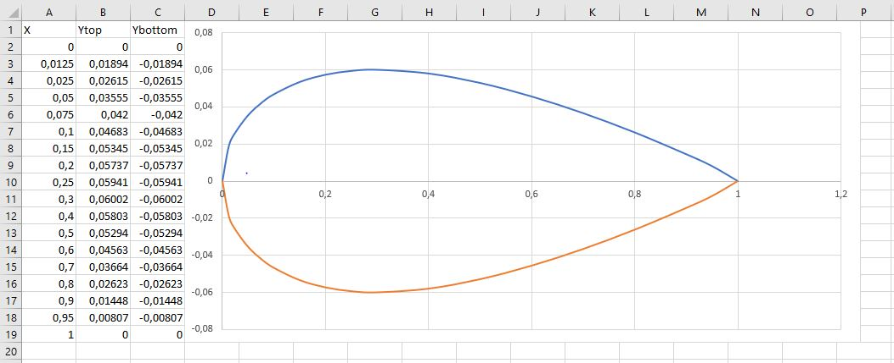
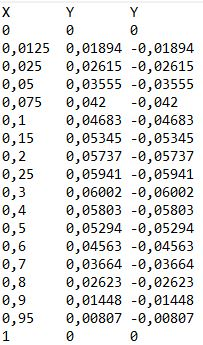
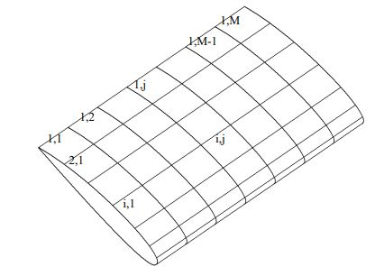
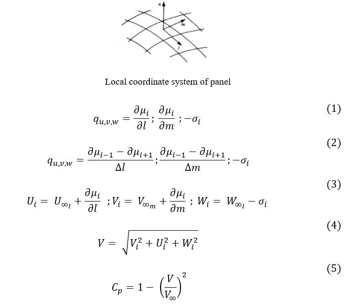
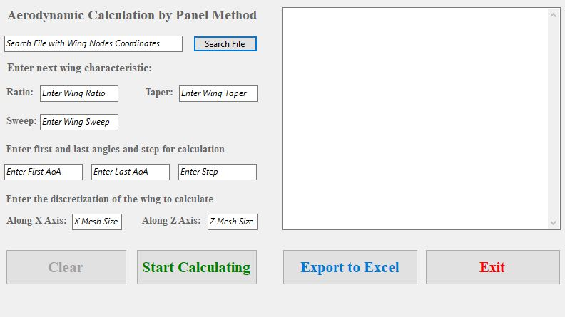
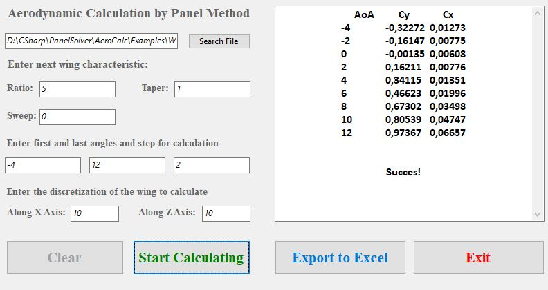
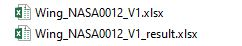
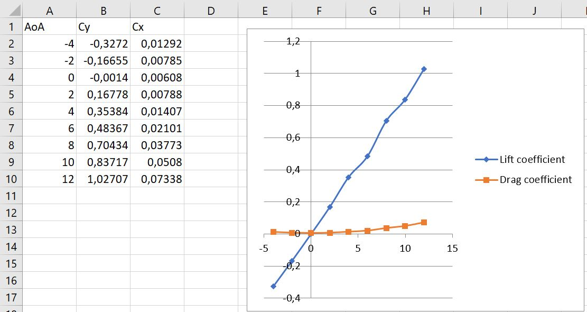

<h1><i> Aerodynamic Calculation by Panel Method</i></h1>

## **Overview**

In this project, the calculation of the aerodynamic characteristics of the wing in a stationary subsonic flow of an ideal gas is implemented. The wing geometry is discretized by a combination of quad panels with a constant source and a constant dipole. Dipoles are found by solving a system of equations compiled according to the boundary conditions. From the values of the dipole, it is easy to calculate the speed and pressure, and in the end, the aerodynamic coefficients, which are the final goal.

The program was tested on the basis of experiments conducted at TsAGI. Test results are presented in the Examples folder.
_____
______
## **Description**
### **Input Data**

An *.xlsx* or *.txt* file must be submitted as source data. In this file, the wing profile must be described as a set of point coordinates, as shown in the figure below:

Here: point (X[i]; Ytop[i]) - point[i] of the top surface of the wing and point (X[i]; Ybottom[i]) - point[i] of the bottom surface of the wing.

If you are uploading a .txt file, you should separate the values with tabs:

Examples of specifying wing profile points are located in the *Examples* folder.

It is also necessary to present next characteristics of the wing as initial data:

+ Wing Ratio
+ Wing Taper
+ Wing Sweep

Next, you define the angles of attack at which the calculation will be made and discretization along X and Z axis.

After clarification of all initial data, an aerodynamic calculation of the wing will be performed.
_____ 

### **Wing Geometry Discretization**

The wing geometry is discretized along the X and Z axes, as shown in the figure below:

Discretization is done using this [class](MeshGenerator/TMeshGenerator.cs) methods.

### **Discretization along X axis**

In the initial data, the value of the discretization of the wing along the X axis is specified as an integer. Equal segments are built along the X axis from the nose to the tail of the profile. The number of segments is equal to the discretization value.

The Y points of the upper and lower surfaces of the wing, corresponding to the extreme points of the segments, are found using the Lagrange interpolating polynomial.

These conversions are done using the `RootChordNodes` method [here](MeshGenerator/TMeshGenerator.cs).

### **Discretization along Z axis**

In the initial data, the value of the discretization of the wing along the Z axis is specified as an integer. Equal segments are built along the Z axis from the left to the right edge of the wing. The number of segments is equal to the discretization value.

The boundaries of the panels are the chords of the wing, located at an equal distance, in accordance with the ratio, taper and sweep angle of the wing.

These conversions are done using the `BuildPanels` method [here](MeshGenerator/TMeshGenerator.cs).

After discretization, the wing is a set of panels, which are objects of the [TPanel class](Panel/TPanel.cs).
_____
### **Calculation**

Calculation the aerodynamic coefficients occurs in several stages:
+ Calculation of dipoles for each of the panels
+ Calculation of pressure coefficients for each of the panels
+ Calculation of lift and drag coefficients for the wing

### **Dipoles calculation**

Dipoles are calculated by solving a system of equations presented in matrix form. The matrices are compiled and solved using this [class](PanelMethodSolver/TMatrixBuilder.cs) methods.

### **Pressure coefficients calculation**

After dipole strengths have been calculated, calculation of velocity, pressure and
forces can be made using this algorithm:

Here $\mu$ is a dipole

The pressure coefficients are calculated using this [class](PanelMethodSolver/TCpSolver.cs) methods.

### **Lift and drag coefficients calculation**

After pressure coefficients have been calculated, calculation of the wing aerodynamic coefficients can be made. 

Methods for calculation are contained in [this class](PanelMethodSolver/TCyCxSolver.cs).

These aerodynamic coefficients are the final goal of this program calculation.
____
____
## **User Interface**

This program can be launched using the desktop application [AeroCalc.exe](AeroCalc.exe.lnk) in the root folder. 

In the left part of the window, you should enter the initial data.

After that, to start the calculation, you should click on the button *Start Calculating*. The results will be displayed on the right side of the window, and after the calculations are completed, you will receive a message *Success!*.

After that, you can import the data into Excel by clicking on the button *Import to Excel*. A result file will be created in the folder of the input file and with a postscript *_result* in the name:

The Excel file presents the results of calculations:

In the *Example* folder you can see [resuls](Examples/Results.xlsx) of aerodynamic calculations of several wings done using this program.